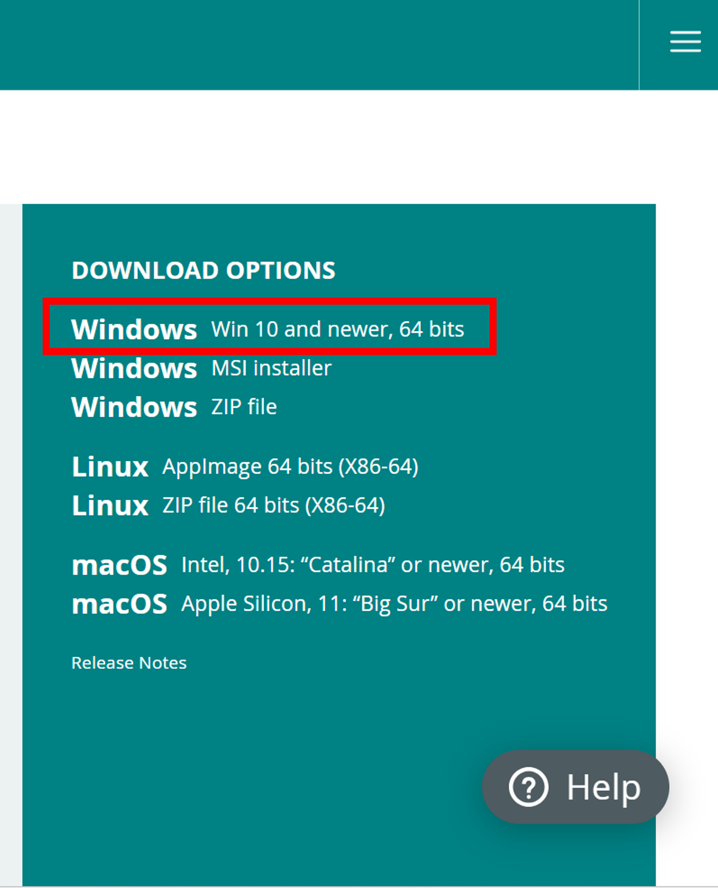
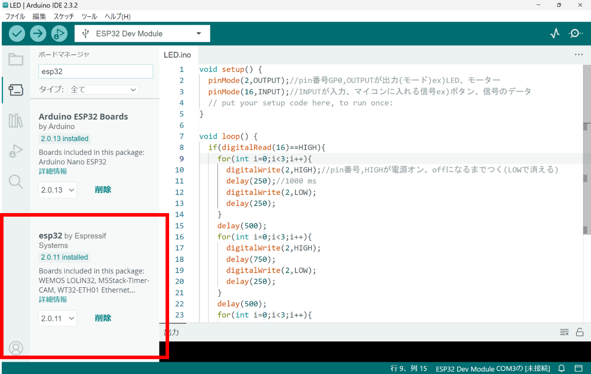

# Lesson0 : Arduino IDEをいれよう

## 0. このドキュメントの目的

ArduinoIDEの環境構築とESP32(skipperW)を使用できるようになることが目的

2024年の自操はprocessingとArduinoを使用している

ESP32を使用することを目標としているが、ほかのマイコンと通じるところもあるため導入や基礎としては使用できると思う

20代　海沼明日香

## 1. Arduino IDEとは

- マイコンを動かすためのソフトウェアを開発するために作られた総合開発環境
- ArduinoはC++ベースのプログラミング言語
- 様々なマイコンやライブラリを簡単に使用できる

## 2.Arduino IDEをインストールしよう
1. [Arduino IDEのダウンロードページ](https://www.arduino.cc/en/software)
にアクセス  
1. SOFTWAREのタブにいく  
1. Windows Win 10 and newer, 64 bitsをインストール

1. ずっとJUST DOWNLOADを選ぶ  
1. ライセンスを読んでAgreeを選択   
1. オプションにすべてチェックを入れる   
1. インストール先を確認してinstall

## 3.Arduino IDEを使おう
- 使用するためにはボードを選択する必要がある
- ボードはボードマネージャーなどから自分でインストールする
- 自操班が使用しているのはESP32

### ボードのインストール
1. ボードマネージャーを開いて「esp32」と入力  
出てくるので「esp32 by Espressif Systems」をインストール

!!! Note
    **参考 他のインストール方法**  
    ボードの名前をネットで検索してURLから追加する方法もある  
    どっちでも結果は同じだが、ボードマネージャーで検索しても出てこない場合やよくわからないときは調べてURLからインストールするほうがいいかもしれない  

### ドライバのインストール
航空研で使用しているESP32はパソコンに手動でドライバをインストールする必要がある

1. ボードを見ると「SIL2104」と書いてあるマイコンがある
1. 検索して
[SILICON LABS](https://jp.silabs.com/interface/usb-bridges/classic/device.cp2104?tab=softwareandtools)にアクセス
1. 「CP210x ユニバーサルWindows ドライバ」をインストール
1. zipファイルを展開して中にある「UpdataParam.bat」を実行  

ボードやドライバのインストールは今後違う種類のマイコンやボードを使用するときにもする必要が出てくると思います  
その時も今回のように検索をして目的に合ったものをインストールしましょう

## まとめ
これでArduino IDEでESP32を使用するための環境が整いました！  
次回からは実際にマイコンを使っていきます!