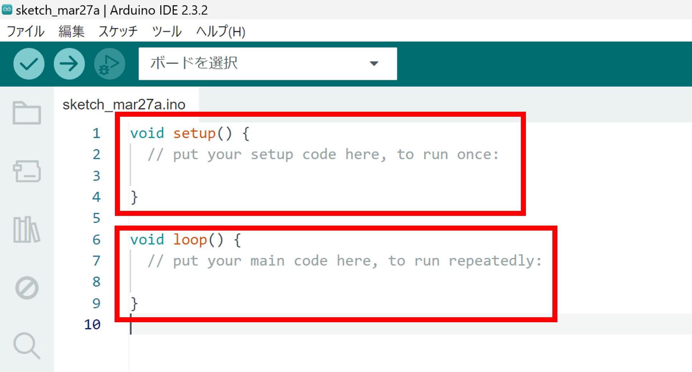
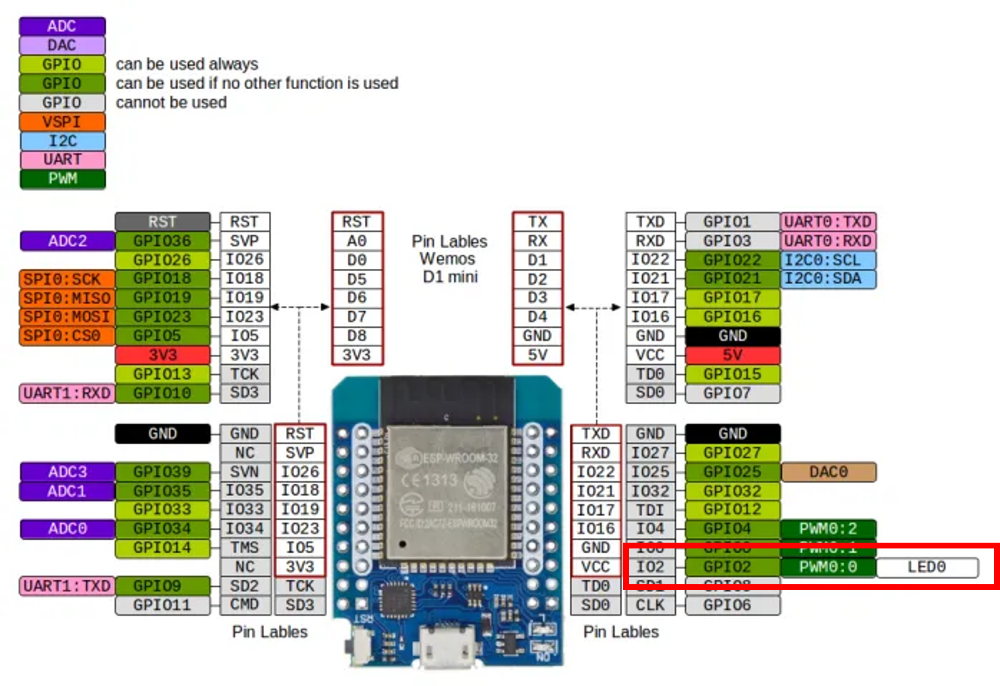
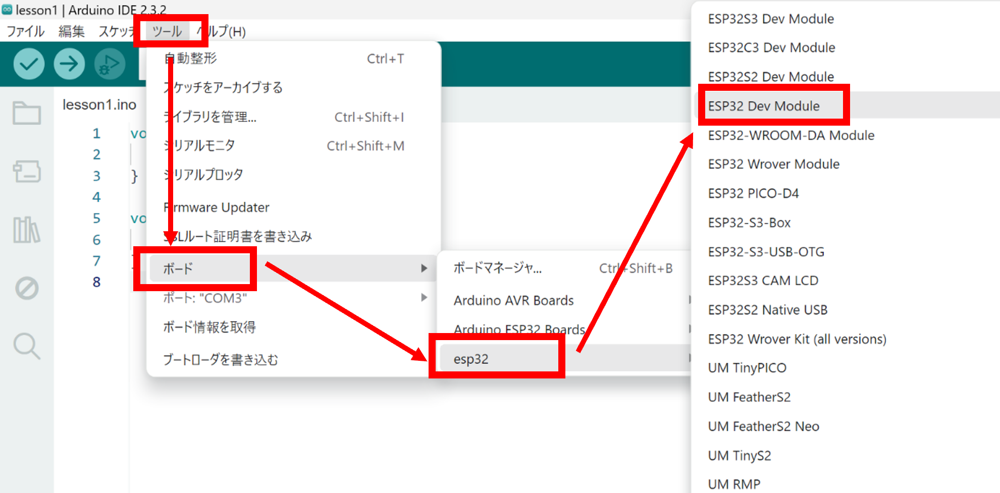
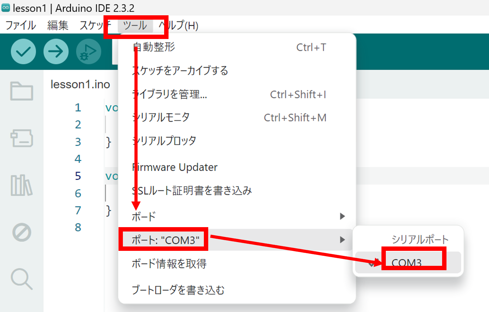
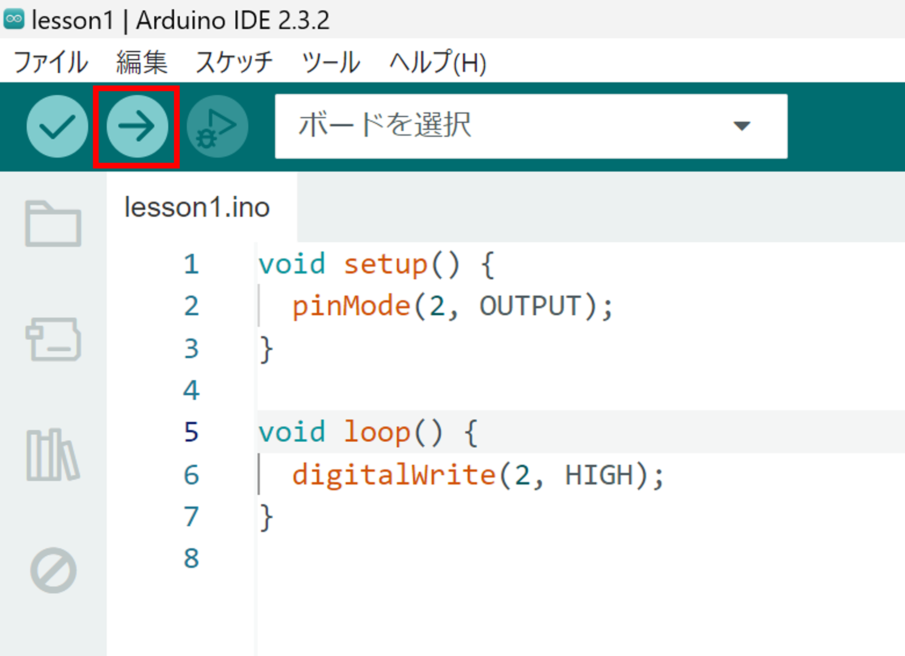

# Lesson1 : LEDをチカチカさせよう

## 1. 基本的な操作
Arduino IDEを起動して新規スケッチを作ると下のような画面が出てくる


- void setup(){} : 一回だけ実行される。設定とかを書く。
- void loop(){} : 繰り返し実行される。設定以外のものを書く。

## 2.LEDを光らせよう
下のようなプログラムを書こう
```c++
void setup(){
    pinMode(2, OUTPUT);
}

void loop(){
    digitalWrite(2, HIGH);
}
```
### コードの説明 
- pinMode(2, OUTPUT);

    - pinMode(ピン番号, モード);
    - ピンは基板であらかじめ決められている番号
    - ピン番号は自由に決めることができる（今回は基板についているLEDを使うので2 pin）
    - LEDは出力なのでOUTPUT
    - ピンは一度決めたらそのまま使用するのでsetupに書く

    **参考 esp32 miniのピン配置**
    

    - GPIO2と書いてあるピンが使用したピン
    - 横にLED0とあるためもともとLEDをして使用することができる

- digitalWrite(2, HIGH);

    - digitalWrite(使用したいピン, HIGH or LOW);
    - ピンはpinModeで設定したピンのみ使用できる
    - HIGHなら5 V, LOWなら0 Vを出力（HIGHなら光る）
    - LEDは継続的に光らせたいのでloopに書く（この場合はsetupでも変わらないがloopに書こう）

### マイコンに書き込んでみよう
- ボードを選択

    - ツール→ボード→esp32→ESP32 Dev Module
    

- ポートを選択

    - 基板とパソコンをUSBで接続
    - ツール→ポート→COMX(Xはパソコンによって異なる)
    

- 書き込み

    - 左上にある「→」をクリック
    - コンパイルが始まって正常にコンパイルされると書き込みが始まる
    - 隣にあるチェックマークをクリックするとコンパイルだけしてくれる
    - 基板を接続していない状態でも使用できるのでコードの確認のときとかに使おう
    

**うまくいくと赤く光っているLEDの隣のLEDが青色に光ります！**

## 3.LEDをチカチカさせよう
さっきのプログラムを少し変えて下のようにしよう
```c++
void setup(){
    pinMode(2, OUTPUT);
}

void loop(){
    digitalWrite(2, HIGH);
    delay(1000);
    digitalWrite(2, LOW);
    delay(1000);
}
```

### コードの説明
- delay(1000);

    - delay(mill sedonds);
    - ()内の単位はミリ秒
    - 今回は1000 ミリ秒なので1 秒
    - delayの中の秒数だけloop関数がその位置で止まる
    - このプログラムだとHIGHになった後一秒おいてLOW

**一秒ごとに点滅しましたか？**

**次回はシリアル通信と呼ばれるものをやります！**

**次からは応用編です。余裕があったら見てください**

## 4. LEDをチカチカさせよう（応用編）

**二つのLEDを別々の周期で光らせましょう**

```c++
uint64_t offset1 = 0;
uint64_t offset2 = 0;
const uint64_t duration1 = 1000;
const uint64_t duration2 = 3000;

void setup() {
  pinMode(2, OUTPUT);
  pinMode(15, OUTPUT);
  offset1 = millis();
  offset2 = millis();
}

void loop() {
  uint64_t currentMS = millis();

  if(currentMS - offset1 >= duration1){
    digitalWrite(2, !digitalRead(2));
    offset1 += duration1; 
  }
  if(currentMS - offset2 >= duration2){
    digitalWrite(15, !digitalRead(15));
    offset2 += duration2; 
  }
}
```

### コードの説明
- uint64_t offset1 = 0;

    - uint64_tはunsigned int 64bit型
    - offset1とoffset2は基準となる時間
    - 点滅するときに基準の時間からの経過ではかるのでLEDの数の二つ用意する

- const uint64_t duration1 = 1000;

    - constがついているものは定数として扱われる
    - 宣言後に代入しても値は変わらない
    - durationは周期の時間
    - duration1は1000, duration2は3000にしているのでLEDはそれぞれ一秒ごと、三秒ごとに点滅する

- offset1 = millis();

    - offsetに基準となる時間を代入
    - 基準なのでsetupに書いてloopに入った後も同じ値を保持できるようにする（後で値を変えたいのでconstにはしない）

- uint64_t currentMS = millis();

    - currentMSは現在の時間
    - loopの中に書いているので常に更新される

- if(currentMS - offset1 >= duration1){}
    - 現在の時間（currentMS）と基準の時間（offset）との差がduratinon以上になったら{}内が実行される

- digitalWrite(2, !digitalRead(2));

    - プログラミング言語においてたいていの場合は「!」は反転など逆の状態を意味する
    - digitalRead(x)はxピンの今の状態を返す関数
    - HIGHなら1、LOWなら0を返す
    - この関数はduraitonを超えたとき（HIGHからLOW、LOWからHIGHにしたいとき）に実行され、元の状態と逆の状態がdigitalWriteに入る

- offset += duration1;

    - += は加算代入
    - offsetはHIGHとLOWを繰り返す度にdurationを加算していく
    - これでまたloopが相対的に0秒から始まったみたいな感じになる