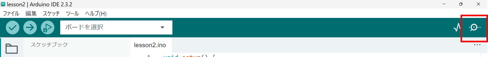
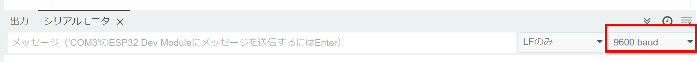
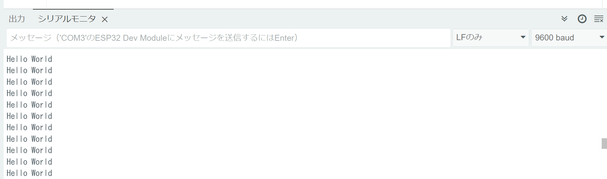
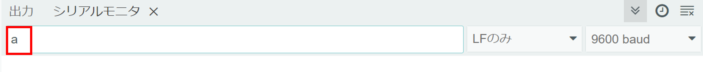
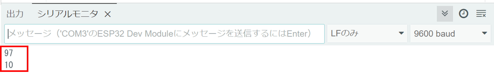
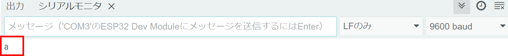

# Lesson2 : シリアル通信を使用

## 1. シリアル通信とは
- 一本だけの通信線でHIGH/LOWの電圧レベルを連続的に変化させて、データを送受信する通信方式
- ボードとコンピュータなどを接続することで送受信したデータを確認することができる

## 2.Hello World
下のようなプログラムを書こう
```c++
void setup(){
    Serial.begin(9600);
}

void loop(){
    Serial.println("Hello World");
}
```
### コードの説明 
- Serial.begin(9600);

    - Serial.begin(baud rate);
    - baud rateはいくつか存在する

- Serial.println("Hello World");

    - Serial.println("文字列");
    - printだと改行なし、printlnだと改行あり
    - ""で囲む。変数を表示するときはそのまま""を使わずに書く

### 実行しよう
- 実行した後、画面右上のシリアルモニタをクリックして起動


- シリアルモニタの右にあるbaud rateをSerial.beginで設定した値に変更


### 実行結果

- シリアルモニタに永遠とHello Worldが表示される


**マイコンからパソコンに文字列を表示することに成功しました！**

## 3.Serial.printとASCII
シリアルモニタで入力した文字を表示するプログラムを書いてみよう
```c++
void setup(){
    Serial.begin(9600);
}

void loop(){
    if(Serial.available() > 0){
        int data = Serial.read();
        Serial.println(data, DEC);//DECは10進数で表すという意味
    }
}
```

### コードの説明
- if(Serial.available() > 0){};

    - Serial.availableはシリアルを受信したときに受信したバイト数を返す関数（64 byteまで格納可能）
    - 受け取ると値が一つずつ減り受信したデータがなくなると0になる
    - 受信していないときは0を返す

- Serial.read();

    - Serial.read()は受信したデータを読み込む関数
    - 1 byteだけ読み込む

### 実行しよう
- シリアルモニタの入力画面で「a」と打ってenter


- 「a」ではなく「97」「10」とでてきてしまう


### 実行結果

- シリアルモニタに永遠とHello Worldが表示される


### ASCIIコード

- Serial.printはASCIIコードとして処理している
- ASCIIコードとはアルファベットや記号が0 ~ 127の数字で表されるコード
([ASCIIコード表](https://www3.nit.ac.jp/~tamura/ex2/ascii.html))
- 「a」はASCIIコードでは「97」、「改行(LF)」は「10」で表されるため、あのような出力になった
- 「Hello World」が正しく出力されたのは、Serial.printでは文字列はそのまま扱われるから
- 入力した文字をそのまま表示するためにはSerial.read()で受信した数値をchar型の変数に入れればよい（そもそも元々はint型に代入していたので文字が表示されるわけがない）

- int data → char data, Serial.print(data, DEC); → Serial.print(data);に書き換えよう

### 実行しよう
- シリアルモニタの入力画面で「a」と打ってenter


### 実行結果

- ちゃんと「a」と出力されました


**Serial.printとASCIIコードについてやりました。同じ文字を送っているのに表示が違うのはややこしいかもしれませんがシリアル通信は今後もよく使うので頑張りましょう**

**次回はセンサーを使います！**

**加速度や気圧などの値を見ることができます！**