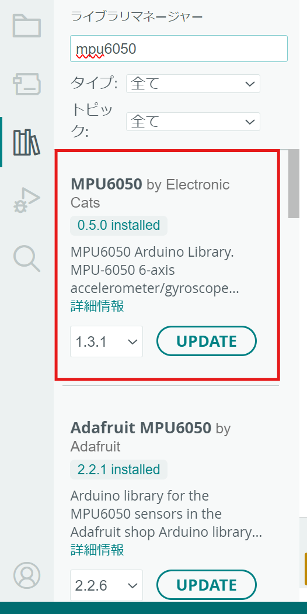
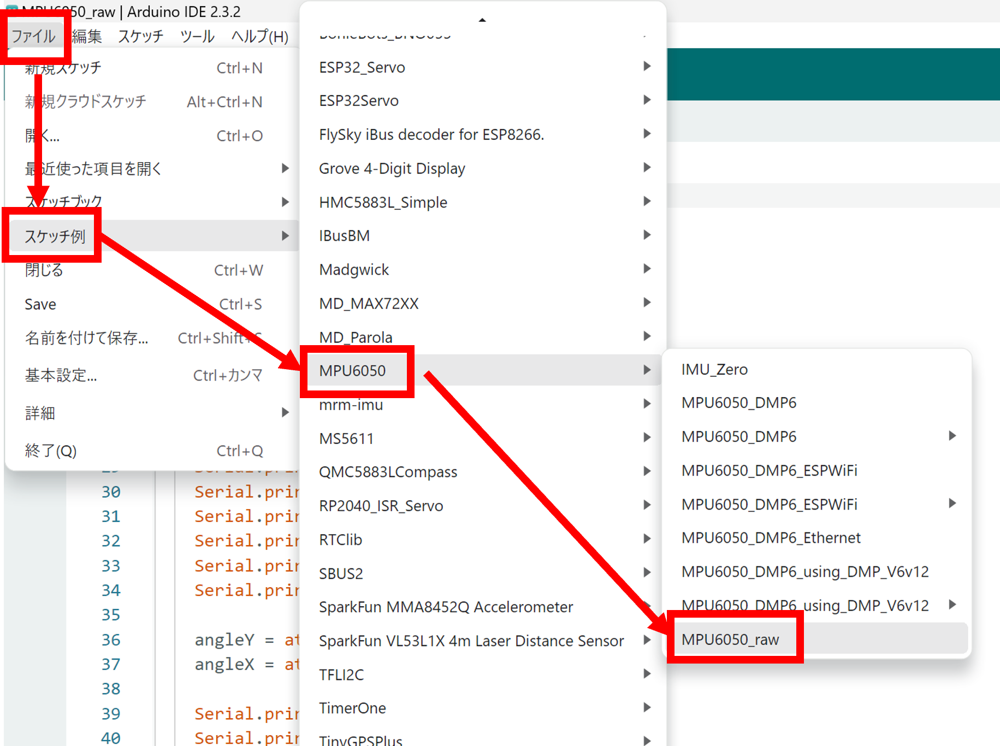
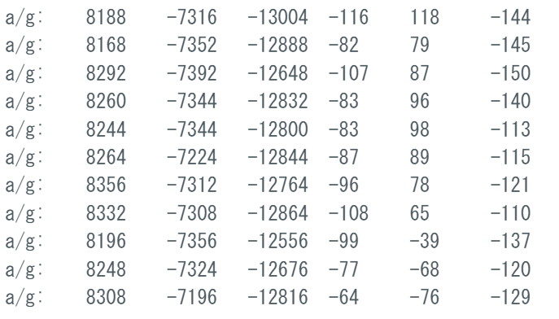

# Lesson3 : センサーを使おう

## 1. 使用するセンサー
- センサーには加速度センサー、地磁気センサー、気圧センサー、気温センサーなど様々なものがある
- これらのセンサーとマイコンを接続し通信することで、センサーを使用できる
- 今回使用するのは**GY-86**という、センサーがたくさん載っているボード
- 搭載センサー
    - 三軸ジャイロ、三軸加速度 : mpu6050
    - 三軸地磁気 : hmc5883l
    - 気温・気圧 : ms5611
- 通信方式 : I2C
- 電源 : 3 ~ 5 V

## 2.ライブラリのインストール
- センサーをArduino環境で簡単に使うライブラリが多く存在する
- ライブラリはプログラムを簡単に書くためのツール（詳しくは後述する）
- 試しにmpu6050を使う準備を使用
- 必要になるライブラリはmpu6050に関するライブラリ
- I2C通信に必要なライブラリはmpu6050で追加するライブラリ内と、標準でインストールされている
もので別でインストールする必要はない

ライブラリマネージャーを開いて「mpu6050」と入力

「MPU6050」をインストール

<!-- 追加でI2C通信をするのに必要な「Adafruit Busl」「SparkFun MMA8452Q Accelerometer」もインストール -->

!!! Note
    **参考 他のインストール方法**  
    センサーや使いたい機能の名前をネットで検索してzip形式から追加する方法もある。その場合は「スケッチ→ライブラリをインクルード→.ZIP形式のライブラリをインストール」でローカルのzipファイルをインストールすることができる

    どちらでやっても結果は同じだが、ライブラリマネージャーで検索しても出てこない場合やよくわからないときは調べてzip形式をインクルードのほうがいいかもしれない

**これでセンサーを使う準備ができました！**

## 3.プログラムを開いて値を見よう
- ライブラリをインストールしたため、サンプルスケッチを使用できるようになった
- 試しに「ファイル→スケッチ例→MPU6050→MPU6050_raw」を開いてみよう

とりあえずマイコンに書き込んでみよう

### 実行結果
- 加速度(a)と角速度(g)が出てくる
- しかし値が正しくなさそうに見える→定数で割って変換

### 値調整
- MPU6050では加速度を16384,角速度を131で割るといい感じの値になる
- 加速度の単位がg,角速度はdegree per second

### ライブラリとは
- センサーから受け取ったデータの処理や通信などのプログラムが書かれている塊のようなもの
- ヘッダファイル(.h)をインクルード(#include)することで使用することができる
- ヘッダファイルの中身はctrlを押しながらクリックすることで確認できる
- 検索してgithubなどのページを見るとそのライブラリの仕様や関数の説明などを見ることができる

### サンプルスケッチ

- サンプルスケッチの中には必要のないコードも多く含まれている
- MPU6050_rawのコードは152行あるが、必要な分だけにすると約40行ほどまで少なくなる
- 処理の多いプログラムになってくると書き込みや実行速度が遅くなるためプログラムの処理を簡潔にすることは重要である

### 補足
ライブラリを使用しなくてもセンサーからの値を受け取って確認することはできる

しかしそれにはセンサーからどのような形で送られてくるか、何バイト目にどのデータが入っているかなどを調べてからそのプログラムを書く必要があるため難しい

Arduino環境下でのESP32に関数ライブラリは豊富なため有効に活用していこう

## まとめ

欲しいデータを取得することができました！

他のセンサー類も同じようにして使うことができます！

次回はサーボモーターを動かしてみましょう！