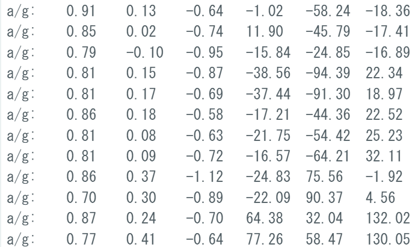

# Lesson4 : サーボを使おう

## 1. サーボとは
- ラジコン飛行機の翼を動かすためなどに使うモーター
- 角度や回転速度を指定することでしてした通りに動作しその状態を保持しようとする
- 航空研ではE-MAXデジタルマイクロサーボ ES9051や9251などを使用している
- PWM制御をしている

## 2.ライブラリのインストール
1. 「esp32 servo library」と検索して[githubのサイト](https://github.com/jkb-git/ESP32Servo)にアクセスしよう
1. 「code→download zip」でライブラリのzipファイルをダウンロード
1. [zipファイルのライブラリをインストールする方法](lessson3のurl)でライブラリをインストールしよう 

**これでサーボを使う準備ができました！**

## 3.サーボを動かすプログラムを書いてみよう
下のプログラムを書いてみよう
```c++
#include <ESP32_Servo.h>

Servo servotest;

void setup() {
  servotest.attach(5);
}

void loop() {
  servotest.write(0);
  delay(3000);
  servotest.write(180);
  delay(3000);
}
```
### コードの説明
- include
    - ヘッダファイルのインクルード
    - 「;」は必要ない
- Servo servotest;
    - Servo サーボの名前;
    - 使用するサーボに名前を付けて変数のように宣言する
    - 受信していないときは0を返す
- servotest.attach(5);
    - サーボ名.attach(ピン番号);
    - サーボに使用するピンを指定する
    - esp32 miniなら「GPIO」などをサーボを動かすために使用することができる
- servotest.write(0);
    - servotest.write(0~180);
    - サーボを動かす値を指定する
    - 0 ~ 180の値を入れる

### 配線
- サーボには「信号線」「5V線」「グランド線(GND)」がある
- それぞれ信号線は白や黄色、5V線は赤色、GND線は黒色や茶色とだいたい色は決まっている


### 値調整
- MPU6050では加速度を16384,角速度を131で割るといい感じの値になる
- 加速度の単位がg,角速度はdegree per second


### ライブラリとは
- センサーから受け取ったデータの処理や通信などのプログラムが書かれている塊のようなもの
- ヘッダファイル(.h)をインクルード(#include)することで使用することができる
- ヘッダファイルの中身はctrlを押しながらクリックすることで確認できる
- また検索してgithubなどのページを見るとそのライブラリの仕様や関数の説明などを見ることができる

### サンプルスケッチ

- サンプルスケッチの中には必要のないコードも多く含まれている
- MPU6050_rawのコードは152行あるが、必要な分だけにすると約40行ほどまで少なくなる
- 長いプログラムになってくると書き込みや実行速度が遅くなるためプログラムの処理を簡潔にすることは重要である

### 補足
ライブラリを使用しなくてもセンサーからの値を受け取って確認することはできる

しかしそれにはセンサーからどのような形で送られてくるか、何バイト目にどのデータが入っているかなどを調べてからそのプログラムを書く必要があるため難しい

Arduino環境下でのESP32に関数ライブラリは豊富なため有効に活用していこう

## まとめ
欲しいデータを取得することができました！