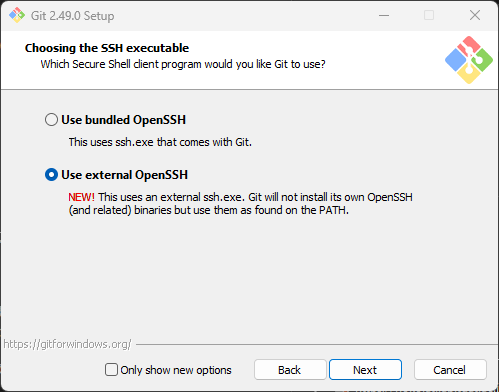
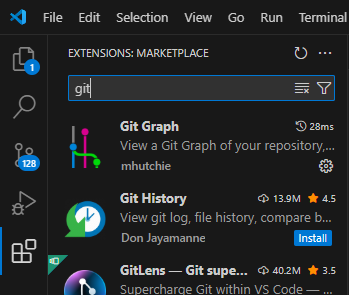
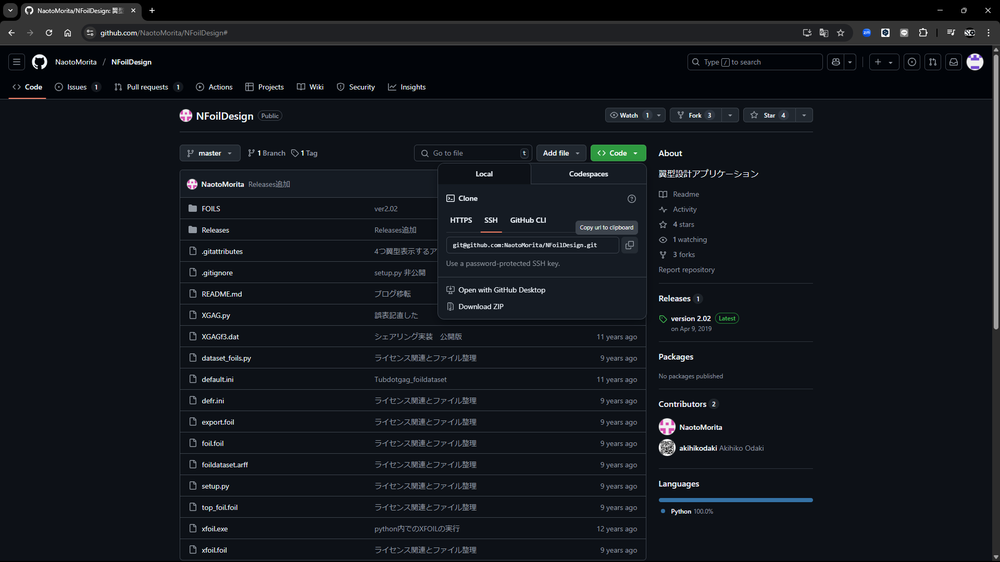

# Setup Git and GitHub for windows
Windows向けにGitの環境構築とGitHubをSSHで使用するための初期設定について述べる．
また，最後にVS Code向けのおすすめの拡張機能も紹介する．
なお，本項ではより詳細な説明のあるウェブページへのリンクをつけることで，一部の解説を省略する．

## What is git and github?
Gitはバージョン管理システムの1つであり，プログラムのバージョン管理に広く使用されている．
GitHubはGitをオンラインで使用するためのサービスでもっとも有名なものの1つである．
多くのオープンソースプロジェクトがGitHubを使用している．NoKoLATでも2023年くらいから，GitHubを使用している．

## Install "Git for Windows"
[リンク](https://gitforwindows.org/)よりGit for windowsのインストーラーをダウンロードし，Git for windowsをインストールしてください．
デフォルトの設定では，ユーザーフォルダーがアスキーコードで表現できない場合にssh接続でエラーが発生します．
インストール時の**Choosing the SSH executable**で**Use External OpenSSH**を選択してください．
その他の項目についてはデフォルト値で問題ありません．

ref : [https://qiita.com/takeru-hirai/items/4fbe6593d42f9a844b1c](https://qiita.com/takeru-hirai/items/4fbe6593d42f9a844b1c)
## Prepare SSH Key
1. .sshディレクトリに移動する  
 `cd ~\.ssh`を実行して.sshに移動する  
 `your_account_name`は人によって異なるので，自分の環境で確認する
 .sshフォルダが存在しない場合は作成する
1. SSH keyの生成  
 ターミナルで以下の`ssh-keygen`を実行する  
 ファイル名を聞かれるので，github用であることが分かるように**github**とした  
 以下のようなターミナル出力が得られる  
 <pre><code>
    PS C:\Users\conat\.ssh> ssh-keygen  
    Generating public/private ed25519 key pair.  
    Enter file in which to save the key (C:\Users\conat/.ssh/id_ed25519): github  
    Enter passphrase (empty for no passphrase):   
    Enter same passphrase again:   
    Your identification has been saved in github  
    Your public key has been saved in github.pub  
    The key fingerprint is:  
    SHA256:doawkcEpALBUkoCoCEn7HrzwZA0qQTZaKE5D0sxQnUU conat@DESKTOP-B94OIN1  
    The key's randomart image is:  
    +--[ED25519 256]--+  
    |&^*+ =E.         |  
    |&*B + oo         |  
    |@... .+          |  
    |oo+ o  + .       |  
    |.o * .. S o      |  
    |. * o  . o       |  
    |   +             |  
    |                 |  
    |                 |  
    +----[SHA256]-----+  
    </code></pre>
3. configファイルの作成  
 .sshフォルダに以下の内容でコンフィグファイルを作成する．  
 もしすでにある場合は追記してください．  
 ファイル名は`config`です．
 <pre><code>
Host github github.com
  HostName github.com
  IdentityFile ~/.ssh/github
  User git
 </code></pre>
## Register SSH key on GitHub
ref : [Github Docs / Connecting to GitHub with SSH](https://docs.github.com/en/authentication/connecting-to-github-with-ssh)
1. githubへ公開キーを登録する
   1. github.pubファイルを開いて内容をコピー
   2. githubで`New SSH Key`を選択
   3. Title : `任意の名前`
   4. Key : 1.1 でコピーしたものを貼り付ける
2. sshで正常に接続できるか確認する  
 ターミナルで`ssh -T git@github.com`を実行する．
 成功すると`Hi [your account name]! You've successfully authenticated, but GitHub does not provide shell access.`と表示されます．

## VS codeでGitを使う
### 拡張機能でGit Graphをインストールする
 Git Graphはgitで管理されたバージョン情報をグラフィカルに表示してくれる拡張機能です．変更履歴などを確認したいときにとても便利です．  
 

### 実際に使ってみる
航空研でよく使用されている翼型生成ソフトウェアXGAGのソースコードをクローンしてみます．
XGAGのリポジトリはクローンの手順を説明するために例として使用しているにすぎません．
手順を一通り追ったあとは削除しましょう．
XGAGのリポジトリは[こちら](https://github.com/NaotoMorita/NFoilDesign/tree/master)にあります．

1. SSH用のクローンリンクをコピーする
 
2. 任意のディレクトリでクローンする
 コマンド : `git clone git@github.com:NaotoMorita/NFoilDesign.git`
 NFoilDesignという名前のフォルダが作成され，githubにあるファイルがローカルにコピーされます．
3. VS codeでクローンしたフォルダを開く

これでGithubにあるレポジトリをローカルにコピーして編集する準備が整いました．
本頁では，ファイルの編集に関しては解説しません．先ほどクローンしたフォルダは削除しましょう．
  