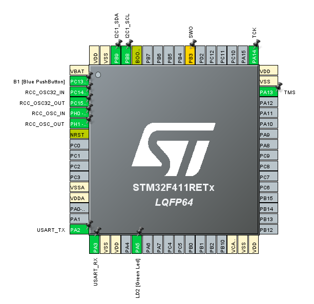
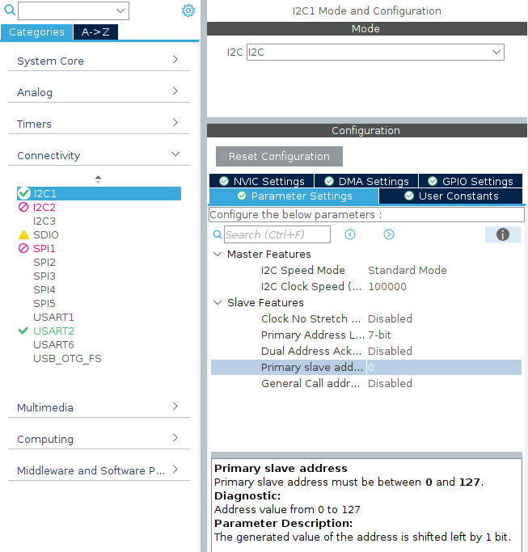
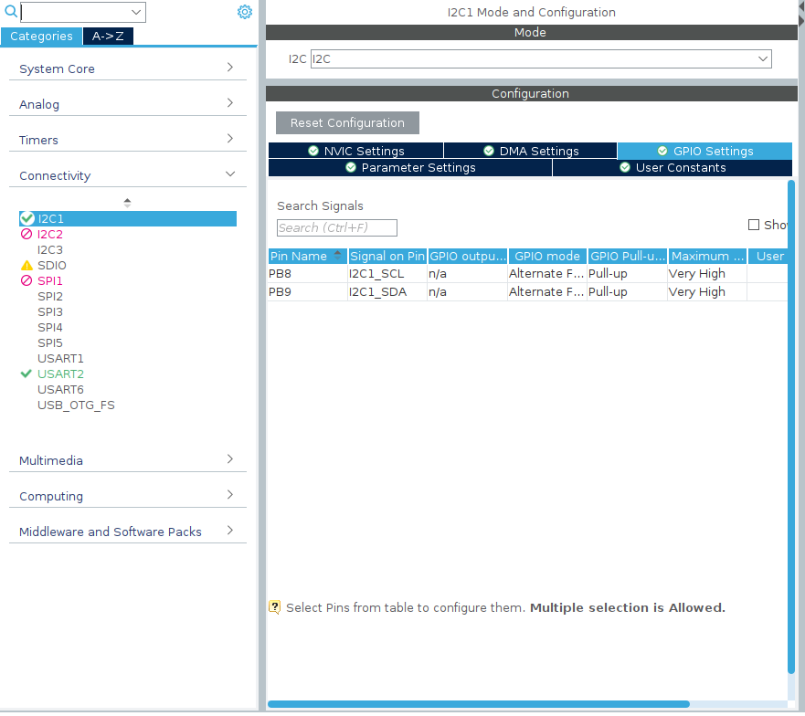

# 5. I2C
I2C通信の解説については[こちら](../../communication/)をご覧ください
## 目標
- I2C通信の使い方を習得する

## CubeMXの設定
1. 使用するピンを設定する
>PB8およびPB9をそれぞれSCL, SDAに設定する
>
2. パラメータを設定する
>`primary slave address`の項目を任意の値$x$に設定する．
>$$ x \in\mathbb{R}| 1<x<255,  x\bmod 2 = 0$$
>
3. 通信するピンのGPIO設定
>2つのピンを両方ともPull-Upに設定した．  
>**CATION:通信相手や回路によってはデバイスの故障につながるので注意してください．**
>

## 期待する動作
マイコンが動作開始すると同時にLEDが1秒間点灯し，消灯する．その後，書き込まれているプログラムがMasterかSlaveかをシリアルで送信する．  
Masterモードではuint16_t型の変数をカウントアップしながらI2Cで送信する．また，シリアルでも値が送信される．  
Slaveモードでは受信した値をシリアルで送信する．  
シリアルモニタで値を確認し，送信側と受信側で同じ値が表示されていれば正常である．

## サンプルコード書き込み時の注意
`#define MASTER`もしくは`#define SLAVE`のどちらかをコメントアウトしてください.  
`#define SLAVE`をコメントアウトした場合はI2CがMasterモードでデータを送信します．  
`#define MASTER`をコメントアウトした場合はI2CがSlaveモードでデータを受信します．

## コード解説
今回はサンプルコードで使用していないものであっても，知っているべき関数は示している．
### `HAL_I2C_Master_Transmit(I2C_HandleTypeDef *hi2c, uint16_t DevAddress, uint8_t *pData, uint16_t Size, uint32_t Timeout)`
Masterモードでデータを送信するために使用する．受信側のマイコンでは`HAL_I2C_Slave_Receive()`を使用してデータの受信をする．
### `HAL_I2C_Master_Receive(I2C_HandleTypeDef *hi2c, uint16_t DevAddress, uint8_t *pData, uint16_t Size, uint32_t Timeout)`
Masterモードでデータを受信するために使用する．送信側のマイコンでは`HAL_I2C_Slave_Transmit()`を使用してデータの送信をする．
### `HAL_I2C_Slave_Transmit(I2C_HandleTypeDef *hi2c, uint8_t *pData, uint16_t Size, uint32_t Timeout)`
Slaveモードでデータを送信するために使用する．
### `HAL_I2C_Slave_Receive(I2C_HandleTypeDef *hi2c, uint8_t *pData, uint16_t Size, uint32_t Timeout)`
Slaveモドでデータを受信するために使用する．
### `HAL_I2C_Mem_Read(I2C_HandleTypeDef *hi2c, uint16_t DevAddress, uint16_t MemAddress, uint16_t MemAddSize, uint8_t *pData, uint16_t Size, uint32_t Timeout)`
主に，センサからデータの読み出しをする場合に使用する．一般的なセンサであれば，この関数を使用することでデータの取り出しが可能である．
### `HAL_I2C_Mem_Write(I2C_HandleTypeDef *hi2c, uint16_t DevAddress, uint16_t MemAddress, uint16_t MemAddSize, uint8_t *pData, uint16_t Size, uint32_t Timeout)`
主に，センサに設定を書き込むときに使用する．

## Source Code
```c++
#include "wrapper.hpp"

#include <string>
#include <array>

#include <usart.h>
#include <gpio.h>
#include <i2c.h>

#define MASTER
//#define SLAVE

uint16_t number = 0;
const uint8_t slaveAddress = 0;

void init(void){
	HAL_GPIO_WritePin(GPIOA, GPIO_PIN_5, GPIO_PIN_SET);
	HAL_Delay(1000);
	HAL_GPIO_WritePin(GPIOA, GPIO_PIN_5, GPIO_PIN_RESET);
#ifdef MASTER
	std::string str = "this is master\n";
#endif
#ifdef SLAVE
	std::string str = "this is slave\n";
#endif
	HAL_UART_Transmit(&huart2, (uint8_t *)str.c_str(), str.length(), 100);
}

void loop(void){
#ifdef MASTER
	std::string str = "transmit : " + std::to_string(number) + "\n";
	HAL_I2C_Master_Transmit(&hi2c1, slaveAddress<<1, (uint8_t *)&number, sizeof(number), 100);
    HAL_Delay(500);
	number += 1;
#endif
#ifdef SLAVE
	HAL_I2C_Slave_Receive(&hi2c1, slaveAddress, (uint8_t *)&number, sizeof(number), 1000);
	std::string str = "transmit : " + std::to_string(number) + "\n";
#endif
    HAL_UART_Transmit(&huart2, (uint8_t *)str.c_str(), str.length(), 100);

}
```
