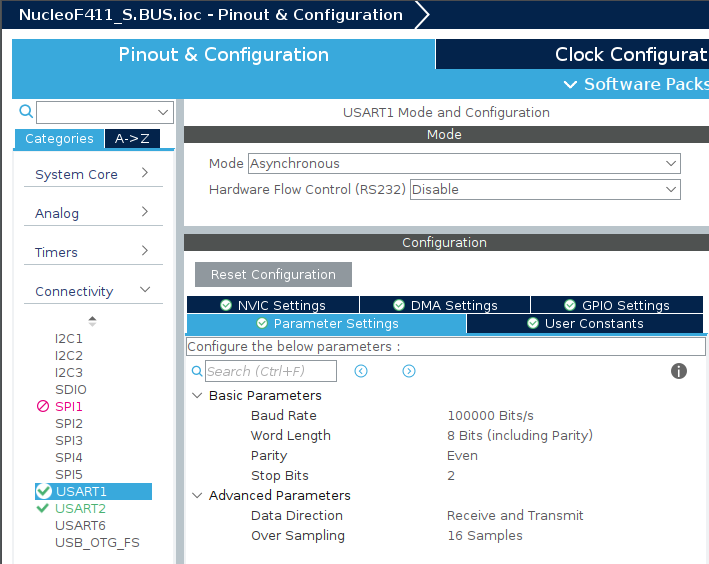
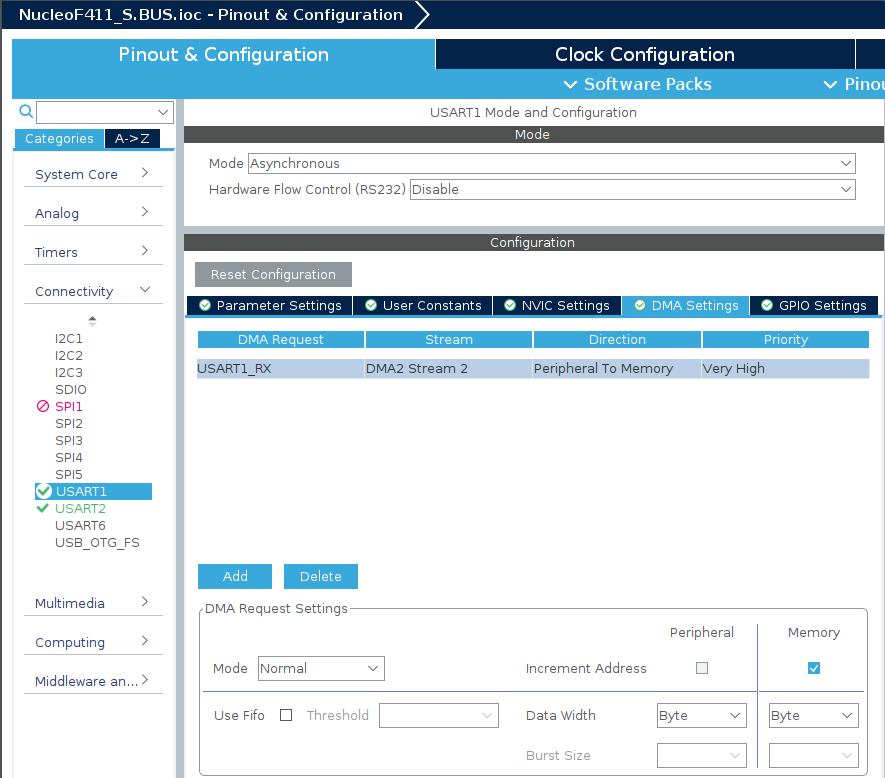
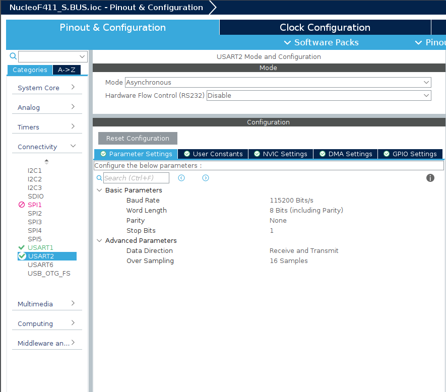

# 3. S.BUS
## CubeMX
### SBUSを受信するUARTの設定
USART1(PA9, PA10)を使用する．
パラメーターの設定は以下の通り．

- Baud rate : 100000 Bits/s
- Parity : Even
- Stop Bits : 2


- DMAの有効化


### シリアルモニタに出力するためのUART


## 期待される動作
マイコンの起動後に，LEDが1秒間の点灯・消灯をした後にSBUSの受信を開始する．
SBUSを正常に受信できている場合は，シリアルモニタにSBUSで受信している値が表示される．

## コードの解説
### HAL_UART_Receive_DMA(UART_HandleTypeDef *huart, uint8_t *pData, uint16_t Size)
この関数はUARTをDMA(Direct memory access)モードで受信する関数である．DMAで受信するとき，受信完了を待たずに他の処理を実行できるため，プログラム全体の処理速度の観点で優れている．DMAの特徴は受信したデータをメモリーに転送する処理をCPUを使わずに行うことである．反対に，DMA以外ではデータを1バイト受信するごとにメモリーに転送する処理を行う必要がある．

### HAL_UART_RxCpltCallback(UART_HandleTypeDef *huart)
この関数はDMAもしくはITでUARTによるデータの受信が終了した際に呼び出される関数である．どのUARTの通信が終了したかは引数を見ると確認できる．複数のUARTを使用するときは`if(huart==&huart2){}`のように場合分けを行う．

### class SBUS{}
c++の**class**という機能を使用してSBUSに関係する処理などを定義しています．見慣れない関数や書き方が多いと思いますが，c++の機能を解説すると長くなるので省略します．口頭で解説するので，解説が必要なら直接聞いてください．

## ソースコード
### wrapper.cpp
```c++
#include "wrapper.hpp"
#include "SBUS.hpp"
#include <functional>
#include <string>

#include <usart.h>
#include <gpio.h>

nokolat::SBUS sbus(&huart1);

std::array<int16_t, 8> buffer;

void init(void){
	HAL_GPIO_WritePin(GPIOA,GPIO_PIN_5, GPIO_PIN_SET);
	HAL_Delay(1000);
	HAL_GPIO_WritePin(GPIOA,GPIO_PIN_5, GPIO_PIN_RESET);
    HAL_Delay(1000);
    HAL_UART_Receive_DMA(&huart1, sbus.getReceiveBufferPtr(),sbus.getDataLen());
}

void loop(void){
	HAL_GPIO_WritePin(GPIOA,GPIO_PIN_5, GPIO_PIN_RESET);
}

void HAL_UART_RxCpltCallback(UART_HandleTypeDef *huart){
    HAL_GPIO_TogglePin(GPIOA,GPIO_PIN_5);
    sbus.setNeedParse();

	std::string str;
	for(uint8_t n=0; n<18; n++){
		str = std::to_string(sbus.getData(n+1)) + " ";
    	HAL_UART_Transmit(&huart2, (uint8_t *)str.c_str(), str.length(), 10);
    }
	str = "\n";
	HAL_UART_Transmit(&huart2, (uint8_t *)str.c_str(), str.length(), 10);

	HAL_UART_Receive_DMA(&huart1, sbus.getReceiveBufferPtr(),sbus.getDataLen());

}
```
### SBUS.hpp
```c++
#ifndef INC_SBUS_HPP_
#define INC_SBUS_HPP_

#include <array>
#include <iterator>

#include "usart.h"

namespace nokolat {

class SBUS {
public:
	SBUS(UART_HandleTypeDef *husart = nullptr)
	:husart(husart){}
	virtual ~SBUS(){};

	auto getBufferIterator(){
		return receiveBuffer.cbegin();
	}

	uint8_t *getReceiveBufferPtr() {
		return (uint8_t*)receiveBuffer.data();
	}

	void enableReciveIT(){
		needParse = true;
		HAL_UART_Receive_IT(husart, receiveBuffer.data(), 25);
	}

	int16_t getData(const uint8_t channel){
		if(channel > 18 or channel < 1) return -1;
		if(needParse){
			parse();
		}

		return data[channel-1];
	}

	constexpr uint8_t getDataLen(){
		return length;
	}

	void setNeedParse(bool arg=true){
		needParse = arg;
	}

private:
	std::array<uint8_t,25> receiveBuffer;
	std::array<uint16_t,18> data;
	bool needParse;
	UART_HandleTypeDef *husart;
	const uint8_t length = 25;

	void parse();
};

} /* namespace nokolat */

#endif /* INC_SBUS_HPP_ */
```
### SBUS.cpp
```c++
#include "SBUS.hpp"

namespace nokolat{
void SBUS::parse(){
		data[0] = receiveBuffer[1];
		data[0] += ((int16_t)receiveBuffer[2] & 0b111)<<8;

		data[1] = receiveBuffer[2]>>3;
		data[1] += ((int16_t)receiveBuffer[3] & 0b111111)<<5;

		data[2] = receiveBuffer[3]>>6;
		data[2] += ((int16_t)receiveBuffer[4])<<2;
		data[2] += ((int16_t)receiveBuffer[5] & 0b1)<<10;

		data[3] = receiveBuffer[5]>>1;
		data[3] += ((int16_t)receiveBuffer[6] & 0b1111)<<7;

		data[4] = receiveBuffer[6]>>4;
		data[4] += ((int16_t)receiveBuffer[7] & 0b1111111)<<4;

		data[5] = receiveBuffer[7]>>7;
		data[5] += ((int16_t)receiveBuffer[8])<<1;
		data[5] += ((int16_t)receiveBuffer[9] & 0b11)<<9;

		data[6] = receiveBuffer[9]>>2;
		data[6] += ((int16_t)receiveBuffer[10] & 0b11111)<<6;

		data[7] = receiveBuffer[10]>>5;
		data[7] += ((int16_t)receiveBuffer[11])<<3;

		data[8] = receiveBuffer[12];
		data[8] += ((int16_t)receiveBuffer[13] & 0b111)<<8;

		data[9] = receiveBuffer[13]>>3;
		data[9] += ((int16_t)receiveBuffer[14] & 0b111111)<<8;

		data[10] = receiveBuffer[14]>>6;
		data[10] += ((int16_t)receiveBuffer[15])<<2;
		data[10] += ((int16_t)receiveBuffer[16] & 0b1)<<10;

		data[11] = receiveBuffer[16]>>1;
		data[11] += ((int16_t)receiveBuffer[17] & 0b1111)<<7;

		data[12] = receiveBuffer[17]>>4;
		data[12] += ((int16_t)receiveBuffer[18] & 0b1111111)<<4;

		data[13] = receiveBuffer[18]>>7;
		data[13] += ((int16_t)receiveBuffer[19])<<1;
		data[13] += ((int16_t)receiveBuffer[20] & 0b11)<<9;

		data[14] = receiveBuffer[20]>>2;
		data[14] += ((int16_t)receiveBuffer[21] & 0b11111)<<6;

		data[15] = receiveBuffer[21]>>5;
		data[15] += ((int16_t)receiveBuffer[22])<<3;

		data[16] = receiveBuffer[23] &0b1;
		data[17] = receiveBuffer[23] &0b10;

		needParse = false;
	}
}
```

## Reference
[Ssample code](https://github.com/NOKOLat/NucleoF411-S.BUS)
