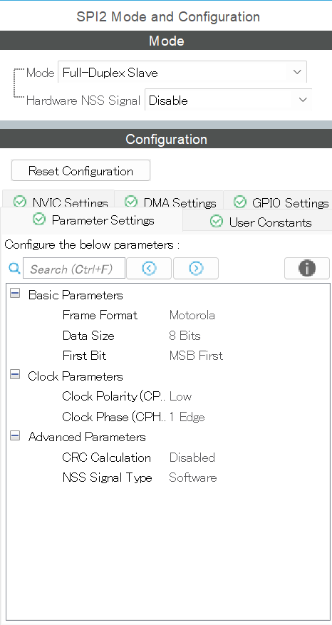

# 6. SPI
SPI通信の解説については[こちら](../../communication/)をご覧ください
## 目標
- SPI通信の使い方を習得する

## CubeMXの設定
>ConnectivityからSPI2を選択し，Masterとする場合はFull-Duplex Masterとし，Slaveとする場合はFull-Duplex Slaveとする．
>

## 期待する動作
マイコンが動作開始すると同時にLEDが1秒間点灯する．その後，書き込まれているプログラムがMasterかSlaveかをシリアルで送信する．  
Masterモードではuint16_t型の変数をカウントアップしながらI2Cで送信する．また，シリアルでも値が送信される．  
SlaveモードではI2Cで受信した値をシリアルで送信する．  
シリアルモニタで値を確認し，送信側と受信側で同じ値が表示されていれば正常である．

## サンプルコード書き込み時の注意
`#define MASTER`もしくは`#define SLAVE`のどちらかをコメントアウトしてください.  
`#define SLAVE`をコメントアウトした場合はI2CがMasterモードでデータを送信します．  
`#define MASTER`をコメントアウトした場合はI2CがSlaveモードでデータを受信します．

## コード解説
今回はサンプルコードで使用していないものであっても，知っているべき関数は示している．
### `HAL_SPI_Transmit(SPI_HandleTypeDef *hspi, uint8_t *pData, uint16_t Size, uint32_t Timeout)`
SPI通信でデータを送信するために使用する．
### `HAL_SPI_Receive(SPI_HandleTypeDef *hspi, uint8_t *pData, uint16_t Size, uint32_t Timeout)`
SPI通信でデータを受信するために使用する．

## Source Code
```c++
#include <string>
#include <spi.h>
#include <usart.h>
#include "WRAPPER.hpp"

#define MASTER
//#define SLAVE

uint16_t number = 0;
const uint8_t slaveAddress = 0;

void init(void){
    HAL_GPIO_WritePin(GPIOA, GPIO_PIN_5, GPIO_PIN_SET);
    HAL_Delay(1000);
    HAL_GPIO_WritePin(GPIOA, GPIO_PIN_5, GPIO_PIN_RESET);
#ifdef MASTER
    std::string str = "this is master\n";
#endif
#ifdef SLAVE
    std::string str = "this is slave\n";
#endif
    HAL_UART_Transmit(&huart2, (uint8_t *)str.c_str(), str.length(), 100);
}

void loop(void){
#ifdef MASTER
    std::string str = "transmit : " + std::to_string(number) + "\n";
    HAL_SPI_Transmit(&hspi2, (uint8_t*)&number, sizeof(number), 100);
    HAL_Delay(500);
    number += 1;
#endif
#ifdef SLAVE
    HAL_SPI_Receive(&hspi2, (uint8_t*)&number, sizeof(number), 100);
    std::string str = "receive : " + std::to_string(number) + "\n";
#endif
    HAL_UART_Transmit(&huart2, (uint8_t *)str.c_str(), str.length(), 100);

}
```
