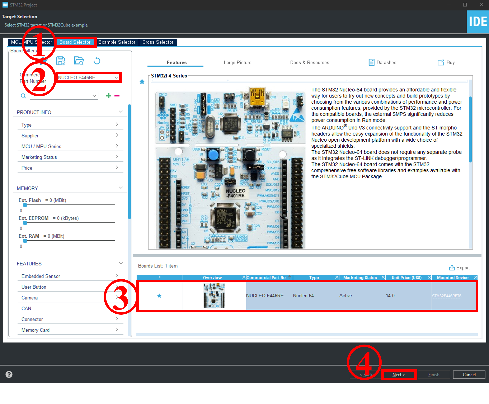
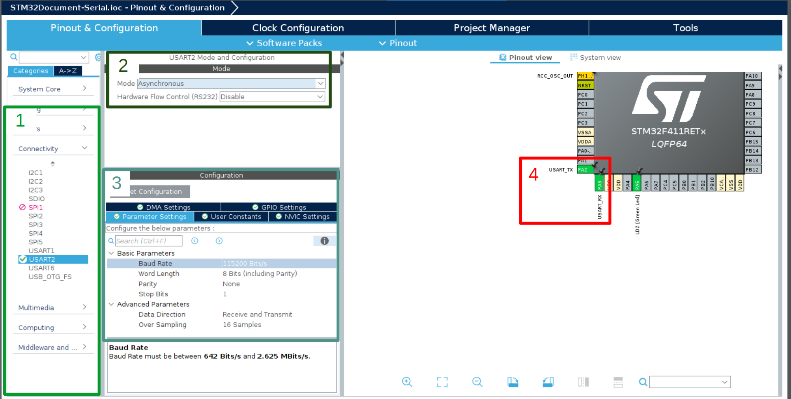
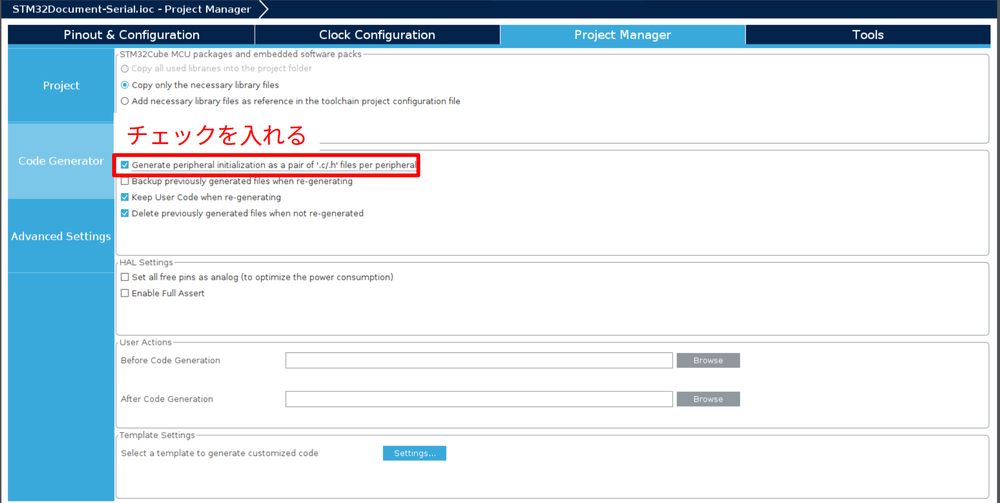

# UART（Serial通信）とツールの使い方
## 目標
- STM32CubeIDEにおけるプロジェクト作成時の定形作業をできるようになる
- HALライブラリの規則を知る
- UARTを使えるようになる

## プロジェクト作成
1. メニューバーから `File/New/STM32 Project` を選択する
>データのダウンロードが自動で行われることがある
2. マイコンの選択を行う
>   2. `Commercial Part Number`に "F446RE"と入力する
>   3. `STM32F446RET6`を選択する
>   4. 次へ進む
>   
1. `Project Name`を入力する
> プロジェクト名は自分で分かれば何でも良いです．
> 特にこだわりがないなら`UART`としておきましょう．
1. `Targeted Language`を`c++`にする

## マイコンの設定（CubeMX）
1. conecctibityからUSART2を選択する
2. Modeを`Asynchronous`に設定する
3. `Baud Rate`を`115200`に設定する
4. マイコンの`PA2, PA3`がUART機能に割り当てられていることを確認する
>
5. 写真を参考にチェックを入れる
>このチェックを入れることを前提としてライブラリの作成等をしているので，忘れないようにしましょう．
>
マイコンの設定は`<Project Name>.ioc`のように拡張子が**ioc**のファイルに保存されている．このファイルを開くとマイコンの設定の画面が開く．

## プログラミング
### Wrapperファイルの作成
本環境ではmain関数がmain.c（C言語）に作成されるため，c++の機能を使用するためにWrapperを作成する必要がある．
1. `Core/Inc`に`wrapper.hpp`を作る
2. `Core/Src`に`wrapper.cpp`を作る


## サンプルコード
### wrapper.hpp
```c++
#ifndef INC_WRAPPER_HPP_
#define INC_WRAPPER_HPP_

#ifdef __cplusplus
extern "C" {
#endif

void init(void);
void loop(void);

void debug();

#ifdef __cplusplus
};
#endif

#endif /* INC_WRAPPER_HPP_ */
```
### wrapper.cpp
```c++
#include "usart.h"
#include <string>


void init(){
	uint8_t str[] = "Hello World";
	HAL_UART_Transmit(&huart2, str,11,100);
}

void loop(){
	static uint16_t count = 0;
	std::string str = "count:"+std::to_string(count++);
	HAL_UART_Transmit(&huart2, (uint8_t *)str.c_str(),str.length(),100);
}
```

### main.c
```c
/* Private includes ----------------------------------------------------------*/
/* USER CODE BEGIN Includes */
#include "wrapper.hpp"
/* USER CODE END Includes */
```
```c
  /* USER CODE BEGIN 2 */
  init();
  /* USER CODE END 2 */

  /* Infinite loop */
  /* USER CODE BEGIN WHILE */
  while (1)
  {
	  loop();
    /* USER CODE END WHILE */

    /* USER CODE BEGIN 3 */
  }
  /* USER CODE END 3 */
```

