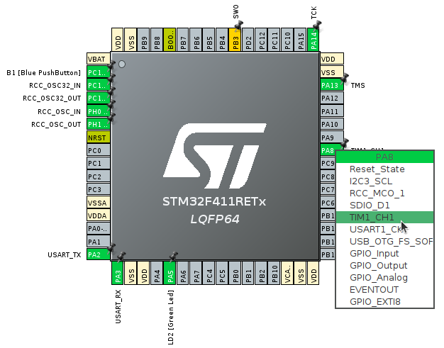
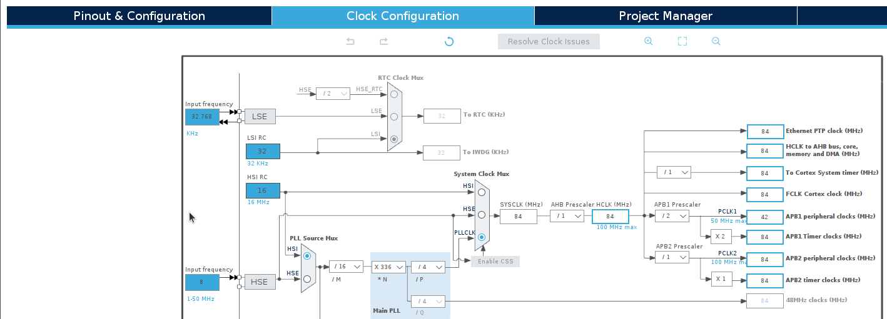
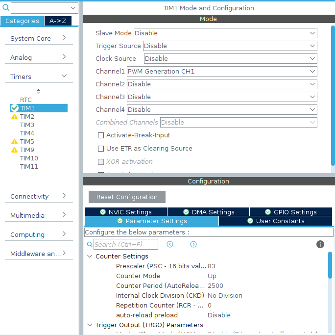

# 4. SERVO
## 目標
- STM32マイコンでのタイマの設定方法を学ぶ

## CubeMXの設定
1. 使用するピンを選択する
>今回は*PA8*を*TIM1_CH1*に設定する
>
2. クロックの確認および設定
>Timerを使用するときは**APB1 Timer clock**および**APB2 Timer clock**の値を確認する．
>この値は，Timerのパラメータを設定する際に使用する．
>

3. Timerの設定
>1. TIM1のChannel1を`PWM Generation CH1`に設定する
>2. Prescalerを`83`に設定する
>3. Counter Periodを`2500`に設定する
>


## コード解説
### `HAL_TIM_PWM_Start(TIM_HandleTypeDef *htim, uint32_t Channel)`
```c
/**
  * @brief  Starts the PWM signal generation.
  * @param  htim TIM handle
  * @param  Channel TIM Channels to be enabled
  *          This parameter can be one of the following values:
  *            @arg TIM_CHANNEL_1: TIM Channel 1 selected
  *            @arg TIM_CHANNEL_2: TIM Channel 2 selected
  *            @arg TIM_CHANNEL_3: TIM Channel 3 selected
  *            @arg TIM_CHANNEL_4: TIM Channel 4 selected
  * @retval HAL status
  */
```

### `__HAL_TIM_SET_COMPARE(__HANDLE__, __CHANNEL__, __COMPARE__)`

```c
/**
  * @brief  Set the TIM Capture Compare Register value on runtime without calling another time ConfigChannel function.
  * @param  __HANDLE__ TIM handle.
  * @param  __CHANNEL__ TIM Channels to be configured.
  *          This parameter can be one of the following values:
  *            @arg TIM_CHANNEL_1: TIM Channel 1 selected
  *            @arg TIM_CHANNEL_2: TIM Channel 2 selected
  *            @arg TIM_CHANNEL_3: TIM Channel 3 selected
  *            @arg TIM_CHANNEL_4: TIM Channel 4 selected
  * @param  __COMPARE__ specifies the Capture Compare register new value.
  * @retval None
  */
```
## ソースコード
### wrapper.cpp
```c++
/* Pre-Processor Begin */
#include "wrapper.hpp"
#include <cmath>

#include "gpio.h"
#include "tim.h"
/* Pre-Processor End */

/* Variable Begin */
const uint16_t CENTER_VALUE = 1500;
uint32_t count = 0;
/* Variable End */

void init(void){
	HAL_TIM_PWM_Start(&htim1, TIM_CHANNEL_1);
	__HAL_TIM_SET_COMPARE(&htim1, TIM_CHANNEL_1, CENTER_VALUE);
}

void loop(void){
	float tmp = std::sin(count++*2.0*M_PI/1000.0)*500;
	__HAL_TIM_SET_COMPARE(&htim1, TIM_CHANNEL_1, uint16_t(CENTER_VALUE+tmp));
	HAL_Delay(2);

}
```
