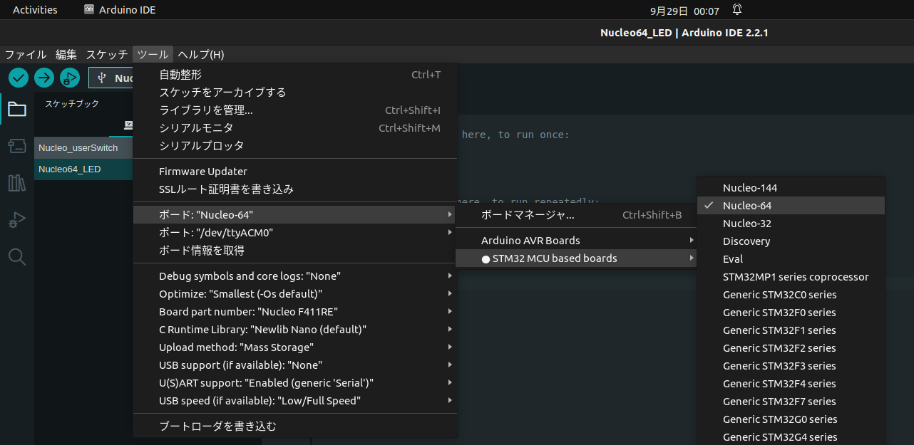
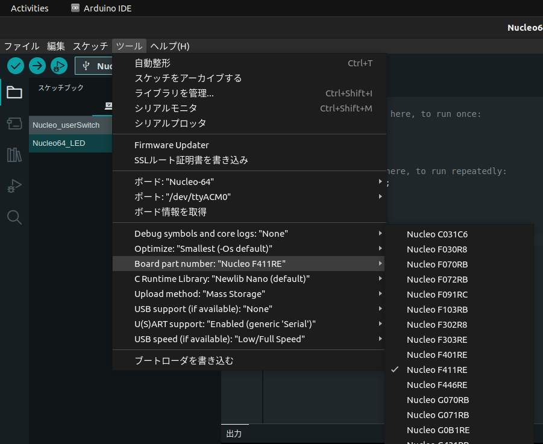

# LEDの点滅
[source code](#source-code)と同じプログラムを作成してください．任意に変更して構いませんが，スケッチの名前は`Nucleo64_LED`とします．

## ボードの選択
- ボードを`Nucleo-64`に設定する


- **Board Part Number**を`Nucleo F411RE`に設定する．
使用するボードが違う場合は適宜変更すること．


## プログラムのコンパイルおよび書き込み
画面左上の**書き込み**ボタンを押す

# スイッチと同期したLEDの点灯

# source code
## LEDの点滅
``` c++ 
void setup() {
  // put your setup code here, to run once:
  pinMode(13, OUTPUT);
}

void loop() {
  // put your main code here, to run repeatedly:
  digitalWrite(13, HIGH);
  delay(200);
  digitalWrite(13, LOW);
  delay(200);
}
```
## スイッチと同期したLEDの点灯
```c++
void setup() {
  // put your setup code here, to run once:
  pinMode(13, OUTPUT);
  pinMode(12, INPUT_PULLUP);
}

void loop() {
  // put your main code here, to run repeatedly:
  if(digitalRead(12)){
    digitalWrite(13, HIGH);
  }else{
    digitalWrite(13, LOW);
  }
}
```