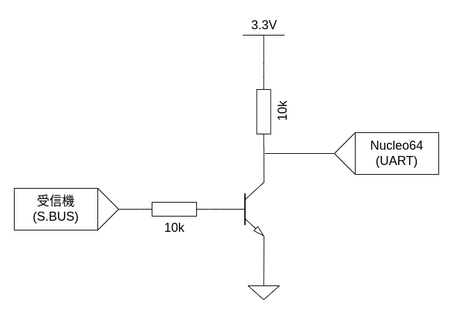

# 4. S.BUSの受信
## 目標
- S.BUS信号について理解する
- S.BUS信号を受信するプログラムおよび回路を理解できる

## S.BUSとは
UART信号を反転したものである．
UARTの設定は以下の通りである．

- 通信速度 : 100000bps
- ストップビット : 2bit
- パリティ : even parity

## S.BUSを受信するための回路
S.BUS信号をUART信号に変換するためには信号を反転すればよいため，NOT回路を入れる．
今回は，Nucleoボードの*CN3*のTXピンにNOT回路の出力を入力する．


## コード解説
### `while(Serial.available()<SBUS_LEN)`
S.BUS信号の長さが25byteであるため，25byteごとに受信処理を実行するように待機する．

### `Serial.write((uint8_t *)sbusReceive.front(),SBUS_LEN)`
受信した値をそのままシリアルモニタに表示するために送信する．

### `digitalWrite(13, !digitalRead(13))`
プログラムの動作確認用のコード．正常動作時は，LEDが高速で点滅する．人の目には点灯しているように見える．
上手く動いていないときは，消灯もしくは点灯する．

## コードの実行結果
### LEDの点滅
正常に動作している場合は，LEDがおよそ70Hzで点滅する．  
受信に失敗している場合は，LEDが点灯もしくは消灯する．

## Source code
```c++
#include <array>

constexpr int SBUS_LEN = 25;

void setup() {
  // put your setup code here, to run once:
  Serial.begin(100000, SERIAL_8E2);
  pinMode(13, OUTPUT);
}

void loop() {
  // put your main code here, to run repeatedly:
  while(Serial.available()<SBUS_LEN);
  std::array<uint8_t, SBUS_LEN> sbusReceive;
  Serial.readBytes((uint8_t *)sbusReceive.front(),SBUS_LEN);
  Serial.write((uint8_t *)sbusReceive.front(),SBUS_LEN);
  digitalWrite(13, !digitalRead(13));
}
```