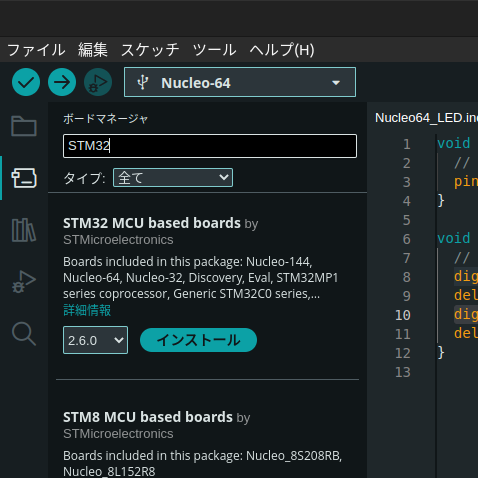

# 環境構築
Arduino webページを参照してください  
[https://www.arduino.cc/en/software](https://www.arduino.cc/en/software)

Arduino IDEを公式HPよりダウンロードし，インストールしてください．

# Nucleo64ボード向けのセットアップ
ドキュメントを参照してください  
[https://github.com/stm32duino/Arduino_Core_STM32/wiki/Getting-Started](https://github.com/stm32duino/Arduino_Core_STM32/wiki/Getting-Started)

1. **File (ファイル)**から**Preferences (基本設定)**を開く
2. **Additional boards managers URLs (追加のボードマネージャーのURL)**に`https://github.com/stm32duino/BoardManagerFiles/raw/main/package_stmicroelectronics_index.json`を追記する
3. **BOARDS MANAGER (ボードマネージャ)**で*STM32*と検索し，**STM32 MCU based boards**をインストールする
   
